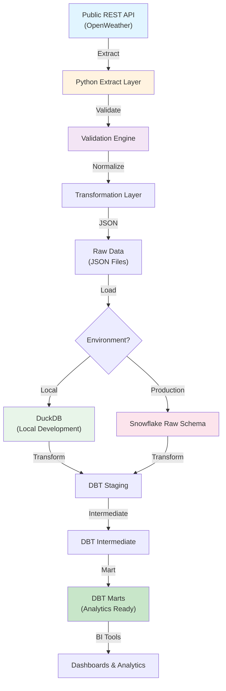

# ELT API Snowflake DBT

[](https://github.com/Sriram18R/elt-api-snowflake-dbt/actions/workflows/ci.yml)

Production-quality ELT pipeline demonstrating enterprise data engineering practices: REST API extraction, data validation, Snowflake loading, and DBT transformation with comprehensive testing and CI/CD automation.

---

## 🎯 Business Problem

**Objective:** Build a scalable, auditable ELT pipeline that:
- Extracts data from a stable public REST API (OpenWeather API - free historical data endpoint)
- Validates and normalizes raw data
- Loads into Snowflake or local DuckDB
- Transforms through medallion architecture (Raw → Staging → Intermediate → Marts)
- Provides production-ready analytics datasets with full data quality assurance

**Use Case:** Weather analytics platform tracking global weather patterns, regional trends, and anomaly detection.

---

## 🏗️ Architecture



**Data Flow:**
1. **Extract**: Python client fetches data via OpenWeather API with retry logic and rate limiting
2. **Validate**: Schema validation, null checks, duplicate detection, business rule validation
3. **Normalize**: Standardize timestamps, null values, column naming conventions
4. **Raw Load**: Store validated JSON in Snowflake `raw_weather` schema
5. **Staging**: DBT models flatten and clean data, `stg_weather_*` tables
6. **Intermediate**: Aggregate and enrich, `int_weather_*` tables
7. **Marts**: Business-ready datasets for specific use cases, `fct_weather_*` and `dim_*` tables

---

## 🛠️ Technology Stack

| Layer | Technology |
|-------|-----------|
| **Extraction** | Python 3.11+, requests, httpx with backoff |
| **Validation** | Pydantic V2, jsonschema |
| **Local Storage** | DuckDB (zero config, SQL-native) |
| **Cloud Data Warehouse** | Snowflake (configurable via env vars) |
| **Transformation** | DBT (data build tool) |
| **Testing** | pytest, pytest-cov, dbt test |
| **Code Quality** | Ruff, mypy, type hints |
| **CI/CD** | GitHub Actions |
| **Logging** | Python structlog, JSON output |

---

## 📁 Project Structure

```
elt-api-snowflake-dbt/
├── ingestion/                          # Python ELT layer
│   ├── __init__.py
│   ├── client.py                       # HTTP client with retry logic
│   ├── extractor.py                    # API data extraction
│   ├── validator.py                    # Schema & data validation
│   ├── transformer.py                  # Data normalization
│   ├── loader.py                       # Snowflake/DuckDB loading
│   ├── exceptions.py                   # Custom exceptions
│   ├── logger.py                       # Structured logging
│   ├── config.py                       # Configuration management
│   └── main.py                         # Orchestration entrypoint
│
├── dbt_project/                        # DBT transformation layer
│   ├── models/
│   │   ├── staging/
│   │   │   ├── stg_weather_observations.sql
│   │   │   ├── stg_weather_cities.sql
│   │   │   └── _stg_weather__staging.yml
│   │   ├── intermediate/
│   │   │   ├── int_weather_daily_aggregates.sql
│   │   │   ├── int_weather_regional_stats.sql
│   │   │   └── _int_weather__intermediate.yml
│   │   └── marts/
│   │       ├── fct_weather_measurements.sql
│   │       ├── dim_cities.sql
│   │       ├── agg_daily_weather_summary.sql
│   │       └── _marts__mart.yml
│   ├── macros/
│   │   ├── generate_surrogate_key.sql
│   │   └── validate_business_rules.sql
│   ├── tests/
│   │   ├── generic/
│   │   │   └── business_logic_tests.sql
│   │   └── unit/
│   │       └── test_transformations.sql
│   ├── dbt_project.yml
│   ├── profiles.yml.example
│   └── seeds/
│       └── city_reference.csv
│
├── tests/                              # Python test suite
│   ├── __init__.py
│   ├── conftest.py
│   ├── unit/
│   │   ├── test_client.py
│   │   ├── test_extractor.py
│   │   ├── test_validator.py
│   │   ├── test_transformer.py
│   │   └── test_loader.py
│   └── integration/
│       ├── test_e2e_pipeline.py
│       └── fixtures/
│           └── sample_api_response.json
│
├── sample_data/
│   ├── raw_api_response.json
│   ├── validated_data.json
│   └── README.md
│
├── docs/
│   ├── architecture.md
│   ├── snowflake_setup.sql
│   ├── dbt_workflow.md
│   ├── data_quality_framework.md
│   └── deployment_guide.md
│
├── .github/workflows/
│   └── ci.yml                          # GitHub Actions CI/CD
│
├── pyproject.toml                      # Python project config
├── requirements.txt                    # Python dependencies
├── requirements-dev.txt                # Development dependencies
├── .env.example                        # Environment variable template
├── .gitignore                          # Git ignore rules
├── Makefile                            # Convenience commands
└── LICENSE                             # MIT License
```

---

## 🚀 Quick Start

### Prerequisites

- **Python 3.11+**
- **pip** or **uv**
- **Git**
- **DuckDB** (auto-installed) OR **Snowflake account** (optional)
- **DBT** (auto-installed)

### Local Development Setup

```bash
# 1. Clone repository
git clone https://github.com/Sriram18R/elt-api-snowflake-dbt.git
cd elt-api-snowflake-dbt

# 2. Create virtual environment
python -m venv venv
source venv/bin/activate  # On Windows: venv\Scripts\activate

# 3. Install dependencies
pip install -r requirements.txt
pip install -r requirements-dev.txt

# 4. Configure environment
cp .env.example .env
# Edit .env and set:
# - EXECUTION_MODE=local (default)
# - API_BASE_URL (optional, defaults to free tier)

# 5. Run ingestion pipeline (local mode with DuckDB)
python -m ingestion.main

# 6. Run Python tests
pytest -v --cov=ingestion

# 7. Transform with DBT (local DuckDB)
cd dbt_project
dbt deps
dbt run
dbt test

# 8. View data quality summary
dbt test --select state:failed
```

---

## ☁️ Snowflake Setup (Production)

### 1. Configure Snowflake Connection

```bash
# Edit .env with your Snowflake credentials
export EXECUTION_MODE=snowflake
export SNOWFLAKE_ACCOUNT=xy12345.us-east-1
export SNOWFLAKE_USER=elt_user
export SNOWFLAKE_PASSWORD=your_secure_password
export SNOWFLAKE_ROLE=ELT_ROLE
export SNOWFLAKE_WAREHOUSE=ELT_WH
export SNOWFLAKE_DATABASE=ANALYTICS
export SNOWFLAKE_SCHEMA=raw_weather
```

### 2. Execute Setup SQL (as ACCOUNTADMIN)

```bash
# Apply database and schema setup
snowsql -c your_connection -f docs/snowflake_setup.sql

# Grant permissions to ELT role
snowsql -c your_connection << EOF
USE ROLE ACCOUNTADMIN;
GRANT CREATE SCHEMA ON DATABASE ANALYTICS TO ROLE ELT_ROLE;
GRANT USAGE ON WAREHOUSE ELT_WH TO ROLE ELT_ROLE;
EOF
```

### 3. Configure DBT for Snowflake

```bash
cd dbt_project
cp profiles.yml.example profiles.yml
# Edit profiles.yml with your Snowflake credentials
# DBT will use credentials from profiles.yml or environment variables

dbt debug  # Verify connection
dbt run    # Execute transformations
```

### 4. Run Full Pipeline

```bash
# Extract and load to Snowflake
python -m ingestion.main

# Transform
cd dbt_project && dbt run && dbt test
```

---

## 📊 Data Quality Framework

### Validation Layers

**Python (Pre-Load Validation)**
- ✅ Schema validation (Pydantic models)
- ✅ Required fields enforcement
- ✅ Data type coercion with fallback
- ✅ Null handling and unknown value standardization
- ✅ Duplicate detection (composite key: city_id, timestamp)
- ✅ Business rule validation (temperature ranges, date bounds)
- ✅ Source metadata tagging (ingestion_timestamp, source_name, record_id)

**DBT (Post-Load Validation)**
- ✅ Not null constraints
- ✅ Unique key validation
- ✅ Referential integrity (cities dimension)
- ✅ Accepted values (valid weather conditions)
- ✅ Custom business logic tests (weather anomalies)
- ✅ Row count reconciliation (source vs target)

### Data Quality Checks

| Check | Type | Level | Formula |
|-------|------|-------|---------|
| Null Rate | Anomaly | Staging | `COUNT(NULL) / total_rows` |
| Duplicate Rate | Anomaly | Staging | `(rows_total - rows_distinct) / rows_total` |
| Invalid Dates | Validation | Staging | `WHERE DATE < '2000-01-01' OR DATE > CURRENT_DATE` |
| Temperature Bounds | Business Rule | Staging | `WHERE temp_c < -60 OR temp_c > 60` |
| Missing Cities | Referential Integrity | Intermediate | Foreign key constraint on dim_cities |

### Monitoring

```sql
-- Check data quality in Snowflake
SELECT 
    model_name,
    status,
    COUNT(*) as test_count
FROM analytics.dbt_test_results
WHERE test_date >= CURRENT_DATE - 7
GROUP BY 1, 2
ORDER BY 1;
```

---

## 🧪 Testing Strategy

### Python Unit Tests

```bash
# Run all tests with coverage
pytest -v --cov=ingestion --cov-report=html

# Run specific test class
pytest tests/unit/test_validator.py::TestSchemaValidation -v

# Run with markers
pytest -m "not integration" -v
```

**Test Coverage:**
- `test_client.py`: Retry logic, timeouts, connection errors
- `test_extractor.py`: API response parsing, empty results
- `test_validator.py`: Schema validation, duplicate detection, null handling
- `test_transformer.py`: Data normalization, timestamp handling
- `test_loader.py`: DuckDB and Snowflake write operations

### Integration Tests

```bash
# End-to-end: API → Ingestion → Validation → Local DuckDB
pytest tests/integration/test_e2e_pipeline.py -v

# Mocked API, real validation, real local load
# Verifies: schema compliance, data quality, idempotency
```

### DBT Tests

```bash
cd dbt_project

# Run all tests
dbt test

# Run tests for specific model
dbt test --select stg_weather_observations

# Run tests with detailed output
dbt test --store-failures

# View test failures
cat target/dbt_test_results.json | jq '.[] | select(.status == "fail")'
```

**DBT Test Examples:**
```yaml
# Unique and not null on surrogate key
- dbt_utils.unique_combination_of_columns:
    combination_of_columns:
      - observation_id
      - city_id
      - measurement_date

# Referential integrity
- relationships:
    to: ref('dim_cities')
    field: city_id

# Accepted values
- accepted_values:
    values: ['Sunny', 'Cloudy', 'Rainy', 'Snowy', 'Unknown']

# Custom business logic
- custom_weather_bounds:
    column_name: temperature_celsius
```

---

## 🔄 DBT Workflow

### Models and Lineage

```
raw_weather (Snowflake source)
    ├── stg_weather_observations
    │   ├── int_weather_daily_aggregates
    │   └── fct_weather_measurements
    ├── stg_weather_cities
    │   └── dim_cities
    │       └── fct_weather_measurements
    └── agg_daily_weather_summary
```

### Incremental Strategy

**Fact tables** use `table` strategy (full refresh daily):
```sql
{{
  config(
    materialized='table',
    on_schema_change='fail'
  )
}}
```

**Dimensions** use `incremental` strategy with `updated_at` merge key:
```sql
{{
  config(
    materialized='incremental',
    unique_key='city_id',
    on_schema_change='fail'
  )
}}
```

### Running Transformations

```bash
cd dbt_project

# Full refresh (production daily run)
dbt run --full-refresh

# Incremental run (intraday)
dbt run

# Selective run by tag
dbt run --select tag:daily_refresh

# Parse and validate only
dbt compile

# Generate documentation
dbt docs generate
dbt docs serve
```

---

## 🔐 Security & Configuration Management

### Environment Variables

**Never commit `.env` file.** Template provided:

```bash
# .env.example
EXECUTION_MODE=local  # local | snowflake

# API Configuration
API_BASE_URL=https://api.openweathermap.org/data/2.5
API_TIMEOUT_SECONDS=30
MAX_RETRIES=3
BACKOFF_FACTOR=1.5

# Local Storage (DuckDB)
LOCAL_DB_PATH=./data/local_warehouse.duckdb

# Snowflake (Production)
# DO NOT COMMIT ACTUAL CREDENTIALS
SNOWFLAKE_ACCOUNT=
SNOWFLAKE_USER=
SNOWFLAKE_PASSWORD=
SNOWFLAKE_ROLE=
SNOWFLAKE_WAREHOUSE=
SNOWFLAKE_DATABASE=
SNOWFLAKE_SCHEMA=

# Logging
LOG_LEVEL=INFO
LOG_FORMAT=json
```

### Secrets Management

**GitHub Actions:**
- Add Snowflake credentials to repository secrets (`Settings → Secrets and variables → Actions`)
- CI/CD never tests against production Snowflake (only local DuckDB)
- Credential injection via environment at runtime only

**Local Development:**
- Use `.env` file (never committed)
- Load via `python-dotenv`
- Validate no secrets in logs

### Code Review Checklist

- [ ] No hardcoded credentials in code or config
- [ ] All secrets use environment variables
- [ ] `.env` in `.gitignore`
- [ ] Secrets masked in logs and CI output
- [ ] API key handling (only use public endpoints or masked keys)

---

## 🚦 CI/CD Pipeline

### GitHub Actions Workflow (`.github/workflows/ci.yml`)

**Triggers:** Push to `main`, PR to `main`

**Steps:**

1. **Setup** (Python 3.11, DuckDB)
   ```bash
   python -m pip install --upgrade pip
   pip install -r requirements.txt
   pip install -r requirements-dev.txt
   ```

2. **Lint & Type Check** (Ruff, mypy)
   ```bash
   ruff check ingestion tests --select=E,W,F
   mypy ingestion --strict --ignore-missing-imports
   ```

3. **Python Tests** (pytest with coverage)
   ```bash
   pytest tests/ -v --cov=ingestion --cov-report=term-missing
   ```

4. **DBT Compilation** (No Snowflake credentials required)
   ```bash
   cd dbt_project
   dbt parse
   dbt compile
   ```

5. **DBT Local Tests** (Uses DuckDB)
   ```bash
   dbt test --profiles-dir ./profiles
   ```

6. **Coverage Report** (Upload to Codecov)
   ```bash
   codecov -f coverage.xml
   ```

### Local CI Simulation

```bash
make lint
make test
make dbt-compile
make dbt-test
```

---

## 📈 Execution Modes

### Local Mode (Development)

**Database:** DuckDB (serverless, no setup required)

**Setup:**
```bash
export EXECUTION_MODE=local
python -m ingestion.main
# Creates: ./data/local_warehouse.duckdb
```

**Advantages:**
- Zero infrastructure
- Full SQL debugging
- Fast feedback loop
- Reproducible local tests

**Queries:**
```sql
-- Connect with DuckDB CLI
duckdb data/local_warehouse.duckdb

-- List tables
SELECT table_name FROM information_schema.tables;

-- Query raw data
SELECT * FROM raw_weather LIMIT 10;
```

### Snowflake Mode (Production)

**Database:** Snowflake (requires account and credentials)

**Setup:**
```bash
export EXECUTION_MODE=snowflake
export SNOWFLAKE_ACCOUNT=xy12345.us-east-1
# ... (other env vars)
python -m ingestion.main
```

**Advantages:**
- Enterprise-grade scalability
- Multi-tenant isolation
- Native Snowflake BI integration
- Zero-copy data sharing

**Cost Optimization:**
- Uses X-Small warehouse (1 credit/hour) for testing
- Queries run on-demand, no storage cost
- Snowflake query result cache (24 hours)

---

## 📚 Advanced Topics

### Monitoring & Observability

**Structured Logging**

```python
# All logs as JSON (parse with jq)
logger.info("data_loaded", 
    rows_count=1000,
    source="api",
    duration_seconds=2.5,
    warehouse="duckdb"
)
```

**Log Queries:**
```bash
# Filter by event type
cat logs/ingestion.log | jq 'select(.event == "data_loaded")'

# Aggregate duration by source
cat logs/ingestion.log | jq 'group_by(.source) | map({source: .[0].source, avg_duration: map(.duration_seconds) | add / length})'
```

### Incremental Loading

**Idempotent Upsert:**
```python
# loader.py detects duplicates by (city_id, measurement_timestamp)
# Existing records are updated, new records inserted
loader.load_incremental(
    data=validated_data,
    table="raw_weather",
    key_columns=["city_id", "measurement_timestamp"]
)
```

### Error Handling & Recovery

**Retry Strategy:**
- Max retries: 3
- Backoff: exponential (1.5x factor)
- Jitter: ±10%
- Circuit breaker: Fail after 5 consecutive 5xx errors

**Failure Modes:**
- API timeout: Retry with exponential backoff
- Validation failure: Log and skip record, continue pipeline
- Load failure: Raise exception, trigger alerts
- DBT test failure: Block dbt run, alert team

---

## 🔍 Troubleshooting

### Common Issues

**Issue: DuckDB file locked**
```bash
rm data/local_warehouse.duckdb
python -m ingestion.main  # Recreates DB
```

**Issue: Snowflake authentication fails**
```bash
# Verify credentials
snowsql -c your_connection -q "SELECT CURRENT_USER();"

# Check environment variables are loaded
env | grep SNOWFLAKE
```

**Issue: DBT compilation errors**
```bash
cd dbt_project
dbt parse --debug  # Verbose error messages
dbt run --debug --profiles-dir ./profiles
```

**Issue: Tests fail in CI but pass locally**
```bash
# CI uses local DuckDB, verify pytest runs with local config
export EXECUTION_MODE=local
pytest tests/ -v

# Check seed data is committed
git status dbt_project/seeds/
```

---

## 📖 API Reference

### Python Ingestion Module

```python
from ingestion import Extractor, Validator, Transformer, Loader

# 1. Extract
extractor = Extractor(
    base_url="https://api.openweathermap.org/data/2.5",
    timeout_seconds=30,
    max_retries=3
)
raw_data = extractor.extract_weather(city_id="2950159")  # Berlin

# 2. Validate
validator = Validator()
validated_data = validator.validate(raw_data)  # Raises ValidationError on fail

# 3. Transform
transformer = Transformer()
normalized_data = transformer.transform(validated_data)

# 4. Load
loader = Loader(warehouse="duckdb")
loader.load(
    data=normalized_data,
    table="raw_weather",
    mode="incremental"
)
```

### DBT Macros

```sql
-- Generate deterministic surrogate key
{{ generate_surrogate_key(['city_id', 'measurement_date']) }}

-- Validate business rules
{{ validate_business_rules('temperature_celsius', -60, 60) }}
```

---

## 🎓 Learning Resources

- [DBT Docs](https://docs.getdbt.com/)
- [Snowflake SQL Reference](https://docs.snowflake.com/en/sql-reference.html)
- [Pydantic V2 Validation](https://docs.pydantic.dev/latest/)
- [pytest Best Practices](https://docs.pytest.org/)
- [GitHub Actions](https://docs.github.com/en/actions)

---

## 🚧 Future Improvements

- [ ] Incremental fact table loading (delta detection by `updated_at`)
- [ ] Data freshness SLA monitoring (alert if pipeline > 24h old)
- [ ] Cost optimization tracking (Snowflake credit usage dashboard)
- [ ] Schema evolution handling (add/drop columns gracefully)
- [ ] Archival strategy for historical fact data
- [ ] Real-time streaming mode (Kafka → Snowflake)
- [ ] dbt metrics layer for BI integration
- [ ] Advanced data quality (anomaly detection, outlier scoring)
- [ ] Multi-region failover and disaster recovery
- [ ] dbt artifacts versioning and audit trail

---

## 📝 License

MIT License — See [LICENSE](LICENSE) file for details.

---

## 👥 Contributing

Contributions welcome! Please:
1. Fork the repository
2. Create a feature branch (`git checkout -b feature/your-feature`)
3. Add tests for new functionality
4. Run `make test` and `make lint` locally
5. Submit pull request with detailed description

---

## 📞 Support

- **Issues:** [GitHub Issues](https://github.com/Sriram18R/elt-api-snowflake-dbt/issues)
- **Discussions:** [GitHub Discussions](https://github.com/Sriram18R/elt-api-snowflake-dbt/discussions)
- **Documentation:** [./docs/](./docs/)

---

**Last Updated:** 2026-09-01  
**Status:** ✅ Production-Ready
